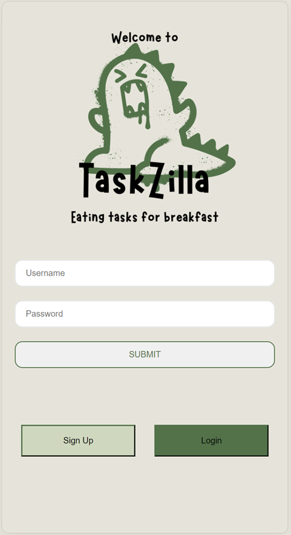

Welcome to TASKZILLA!  
To Do App with Authentication, built using the PERN stack (PostgreSQL, Express.js, React.js, Node.js).  
This application empowers users to manage their tasks efficiently while ensuring their data remains secure with user authentication.

Key Features:

User Authentication: Securely register and log in with unique usernames and passwords.  
To Do Management: Create, update, and delete todos effortlessly.  
To Do Listing: View a comprehensive list of todos, including their status.  
User Logout: Safely logout from your account when done.

Technologies Utilized:

PostgreSQL: Our robust database system ensures reliable storage of user and to do data.  
Express.js: A powerful web application framework that facilitates the creation of RESTful APIs on the server-side.  
Node.js: The backbone of our application, providing a runtime environment for server-side code execution.  
React.js: Enhances the user experience with an interactive and responsive client-side interface.  
bcryptjs: Ensures the security of user passwords through hashing and salting techniques.  
jsonwebtoken: Provides seamless user authentication by generating and validating JSON web tokens.  
react-cookie: Facilitates the storage of user data, enhancing the application's functionality.

API Endpoints:

Our server-side application offers a RESTful API with the following endpoints:  
User Authentication:  
POST /api/auth/signup: Register a new user.  
POST /api/auth/login: Log in an existing user.  
Todo Management:  
GET /api/todos/users/:id: Retrieve all todos for the logged-in user.  
GET /api/todos: Fetch all todos.  
POST /api/todos: Create a new todo.  
PUT /api/todos/:id: Update an existing todo.  
DELETE /api/todos/:id: Delete a todo.

This app is a group effort for our Hyper Island "Beyond the endpoint" course where we as frontend developers started learning backend with Node.js.

Group 4 consists of:
[Petra M.](https://github.com/PetraaM)
[Setayesh](https://github.com/setayeshnri)
[Petra C.](https://github.com/PoppyRed91)
[Moysis](https://github.com/MoysisPap)
[Edward](https://github.com/Edw4l)
